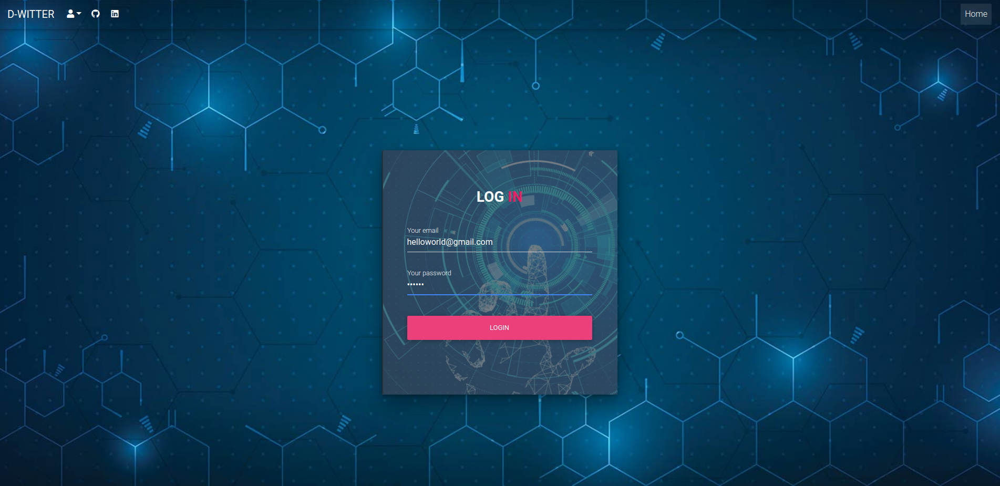
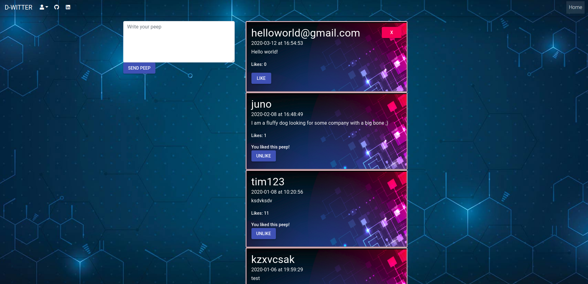

# D-witter

## Description
Mockup of a twitter webapplication.

## Features implemented
- An user can:
- Sign up an new account with username and password.
- Can login with the same username and password used to sign up.
- Can post a peep after login.
- Can delete his/her own peep.
- Can like and dislike all other user's peep. 

## Tech Stack
- React
- Axios
- MDBootstrap

## Run it yourself
Prequisites
Node
MacOS
In terminal:
```
$ git clone https://github.com/LeoRoma/chitterV3.0-react.git
$ cd chitterV3.0-react
$ npm install
$ npm start
```
In browser, visit:

http://localhost:3000/

## Screenshots

### Sign up 


### Login 


### D-witter
